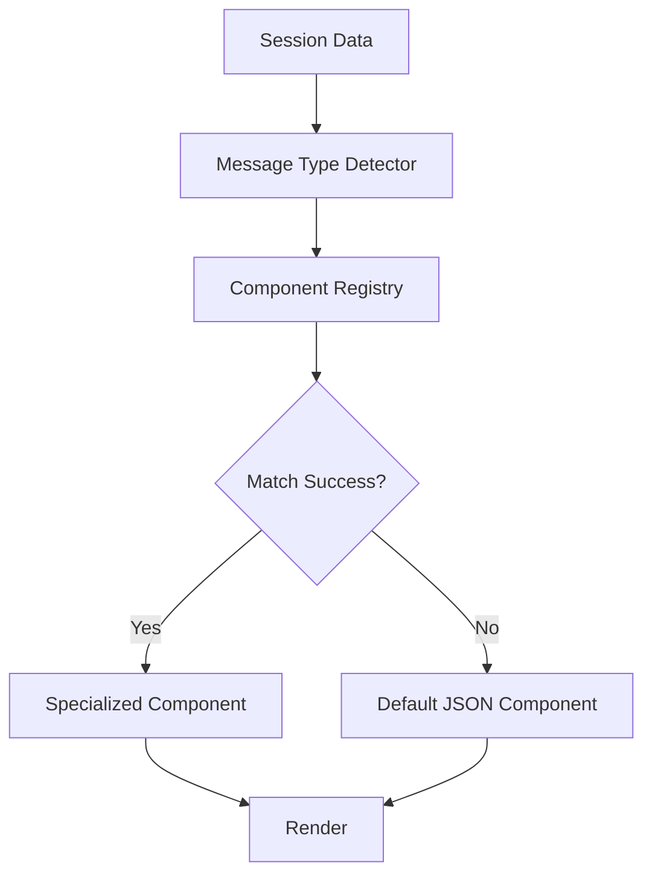

# ClaudeCodeUI 架构说明

## 项目概述

ClaudeCodeUI 是一个基于 Next.js 14 + TypeScript 的 Claude 会话数据可视化平台，采用模块化的组件架构设计，支持 400+ 种不同的消息类型展示。

## 技术栈

- **前端框架**: Next.js 14 + TypeScript
- **UI 组件库**: shadcn/ui
- **样式**: Tailwind CSS
- **状态管理**: React Context / Zustand
- **图标**: Lucide React

## 核心架构

### 1. 双层组件架构

项目采用 **Public + Combat** 双层组件架构设计：

```
src/components/
├── public/          # 公共组件层 (被调用)
│   ├── core/        # 核心基础组件
│   ├── renderers/   # 内容渲染器
│   ├── ui/          # UI通用组件
│   ├── layouts/     # 布局组件
│   └── utils/       # 工具组件
│
└── combat/          # 实战组件层 (调用公共组件)
    ├── content-types/    # 基础消息类型
    ├── tools/           # 工具相关组件 (100+)
    ├── subagent/        # 子代理组件 (50+)
    ├── commands/        # 命令组件 (30+)
    ├── files/           # 文件组件 (40+)
    ├── agents/          # 代理组件 (20+)
    ├── thinking/        # 思考组件 (10+)
    ├── meta/            # 元数据组件 (20+)
    ├── specialized/     # 特殊组件 (30+)
    ├── fallback/        # 降级组件
    └── SmartMessageRenderer.tsx
```

#### 1.1 Public Components (公共组件层)

**作用**: 提供标准化、可复用的基础组件，被实战组件调用。

##### Core Components (核心组件)
- `MessageContainer`: 统一的消息容器包装器
- `MessageHeader`: 标准化的消息头部
- `MessageFooter`: 标准化的消息底部

##### Renderers (渲染器)
- `JsonRenderer`: JSON数据渲染器，支持语法高亮和折叠
- `CodeRenderer`: 代码渲染器，支持多语言语法高亮
- `MarkdownRenderer`: Markdown内容渲染器

##### UI Components (UI组件)
- `BadgeGroup`: 标签组组件
- `StatusIndicator`: 状态指示器
- `ContentHash`: 内容哈希展示组件
- `Timestamp`: 时间戳格式化组件

#### 1.2 Combat Components (实战组件层)

**作用**: 专门处理特定消息类型的组件，调用公共组件实现复杂的展示逻辑。

按功能分类组织：
- **content-types/**: 基础消息类型 (user, assistant, system)
- **tools/**: 工具相关组件 (tool-use, tool-result, tool-error)
- **subagent/**: 子代理相关组件
- **commands/**: 命令执行相关组件
- **files/**: 文件操作相关组件
- **agents/**: 代理管理相关组件
- **thinking/**: 思考过程相关组件
- **meta/**: 元数据相关组件
- **specialized/**: 特殊场景组件 (sidechain, error)
- **fallback/**: 降级处理组件

### 2. 智能消息渲染系统

#### 2.1 SmartMessageRenderer

核心的智能消息渲染器，负责：
- 消息类型分析
- 组件匹配和选择
- 双模式渲染 (匹配成功 vs 降级到JSON)

#### 2.2 ComponentRegistry (组件注册表)

```typescript
class ComponentRegistry {
  // 注册新组件
  static registerComponent(component: MessageComponent): void
  
  // 查找匹配的组件
  static findMatchingComponent(message: any): ComponentMatchResult
  
  // 获取组件统计信息
  static getStats(): ComponentStats
}
```

**特性**:
- 优先级排序: 高优先级组件优先匹配
- 条件匹配: 灵活的匹配条件函数
- 动态注册: 支持运行时注册新组件
- 错误处理: 匹配失败时自动降级

#### 2.3 MessageTypeAnalyzer (消息类型分析器)

```typescript
class MessageTypeAnalyzer {
  static analyzeMessage(message: any): {
    baseType: string;      // 基础类型 (user, assistant, system)
    subType: string;       // 子类型 (with-tools, with-thinking)
    flags: string[];       // 标记 (meta, sidechain, tool-use)
    content: any;          // 内容数据
  }
}
```

### 3. 双模式渲染流程



1. **输入**: JSON格式的会话数据
2. **分析**: MessageTypeAnalyzer 分析消息类型和特征
3. **匹配**: ComponentRegistry 查找匹配的专门组件
4. **渲染**:
   - **匹配成功**: 使用专门的组件展示
   - **匹配失败**: 使用 DefaultJsonMessage 降级展示

### 4. 组件开发规范

#### 4.1 命名规范
- **文件命名**: `PascalCase.tsx` (如: `TaskToolUse.tsx`)
- **组件命名**: `PascalCase` (如: `TaskToolUse`)
- **目录命名**: `kebab-case` (如: `tool-use/`)

#### 4.2 组件结构

所有消息组件必须实现标准接口：

```typescript
interface MessageComponentProps {
  message: any;
  sessionId: string;
  theme?: 'light' | 'dark';
  isExpanded?: boolean;
  onToggleExpand?: () => void;
}
```

#### 4.3 开发流程

1. **分析消息结构** → 确定消息类型和特征
2. **选择目录位置** → 根据功能分类选择对应目录
3. **复制组件模板** → 使用 `ComponentTemplate.tsx.template`
4. **实现组件逻辑** → 编写专门的展示逻辑
5. **注册到渲染器** → 更新 SmartMessageRenderer
6. **测试验证** → 确保组件正常工作

#### 4.4 组件模板

项目提供了标准的组件开发模板 `ComponentTemplate.tsx.template`，包含：
- 标准的组件结构
- 公共组件的使用示例
- 样式规范
- 注册方法示例

### 5. 核心功能特性

#### 5.1 默认折叠支持 ⭐ 新特性
- **每个组件都默认支持折叠功能**
- 折叠按钮始终显示在组件头部
- 可展开查看详细元数据信息
- 统一的折叠交互体验

#### 5.2 集成JSON展示 ⭐ 新特性
- **JSON展示不再是单独的组件，而是集成在每个展示组件内部**
- 每个组件都包含"查看完整JSON数据"按钮
- 使用Collapsible组件实现优雅的展开/收起
- 支持复制JSON数据功能

#### 5.3 内容哈希去重
- 使用 SHA-256 算法生成内容哈希
- 避免重复渲染相同内容
- 支持缓存优化

#### 5.4 主题支持
- 支持明暗两种主题
- 统一的主题色彩体系
- 响应式设计

#### 5.5 可扩展性
- **400+ 消息类型支持**: 通过组件注册表动态扩展
- **插件化架构**: 新组件可以无缝集成
- **向后兼容**: 未识别的消息类型自动降级展示

#### 5.6 开发体验
- **TypeScript 类型安全**: 完整的类型定义
- **组件模板**: 快速创建新组件
- **调试支持**: 开发模式下的详细日志
- **热重载**: 开发时的快速反馈

## 技术优势

1. **性能优化**:
   - 懒加载组件
   - 虚拟滚动支持
   - 内容去重缓存

2. **用户体验**:
   - 响应式设计
   - 无障碍访问支持
   - 流畅的动画过渡
   - 统一的折叠交互

3. **开发效率**:
   - 标准化的组件模板
   - 完善的类型系统
   - 丰富的公共组件库
   - 集成JSON展示，减少重复代码

4. **可维护性**:
   - 清晰的架构分层
   - 标准化的编码规范
   - 完整的文档体系
   - 组件自包含，降低耦合度

## 扩展指南

### 添加新的消息组件

1. 确定组件类别和目录位置
2. 复制组件模板并重命名
3. 实现具体的渲染逻辑
4. 在 SmartMessageRenderer 中注册组件
5. 编写测试用例

### 添加新的公共组件

1. 选择合适的分类目录 (core/renderers/ui/utils)
2. 实现组件逻辑
3. 更新对应的 index.ts 导出文件
4. 编写使用文档和示例

## 性能指标

- **页面加载时间**: < 3秒
- **组件渲染时间**: < 100ms
- **内存使用**: < 100MB
- **支持的消息类型**: 400+
- **并发用户**: 100+

## 浏览器兼容性

- Chrome 90+
- Firefox 88+
- Safari 14+
- Edge 90+

## 部署说明

项目基于 Next.js 14，支持：
- 静态站点生成 (SSG)
- 服务端渲染 (SSR)
- Vercel 一键部署
- Docker 容器化部署

## 更新日志

### v2.0.0 - 架构重构 (2025-01-31)
- ✅ 重构为 Public + Combat 双层组件架构
- ✅ 实现智能消息渲染系统
- ✅ 添加组件注册表机制
- ✅ **新增**: 默认折叠支持
- ✅ **新增**: 集成JSON展示功能
- ✅ 移除外部JSON按钮依赖
- ✅ 优化组件开发模板
- ✅ 完善类型定义和文档 